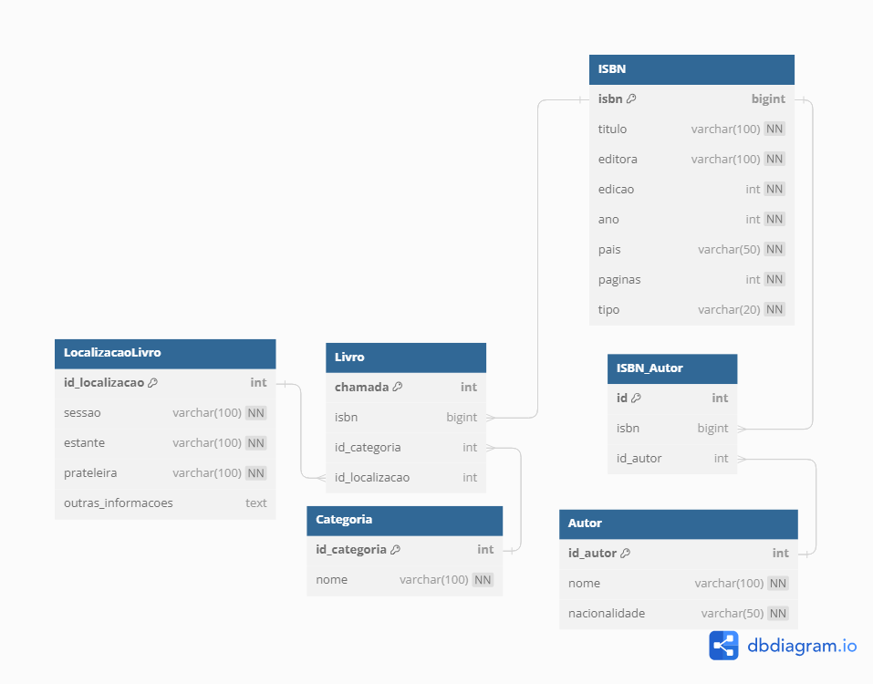

# Biblioteca Ebanx - Modelagem de banco de dados

## Descrição do Projeto
O projeto "Biblioteca Ebanx" é uma modelagem do banco de dados para uma biblioteca, onde é possível armazenar informações sobre os livros disponíveis no acervo, seus autores, categorias e localizações na biblioteca. 

## Como Executar o Projeto

Para executar o projeto, siga as etapas abaixo:

1. Certifique-se de que tenha instalado o MySQL Workbench ou qualquer outro cliente MySQL em sua máquina.

2. Baixe o arquivo `biblioteca_ebanx.sql` e `data_ebanx_biblioteca.sql` fornecidos no repositório.

3. Abra o MySQL Workbench e conecte-se ao servidor de banco de dados onde deseja criar o projeto.

4. Copie o conteúdo do arquivo `biblioteca_ebanx.sql` e cole-o na janela de consulta do MySQL Workbench.

5. Clique no botão "Execute" (ou pressione Ctrl + Enter) para executar o script `biblioteca_ebanx.sql`. Esse script criará o banco de dados "biblioteca_ebanx" e todas as tabelas necessárias, além de estabelecer os relacionamentos entre elas.

6. Após a execução do script `biblioteca_ebanx.sql`, o banco de dados "biblioteca_ebanx" com todas as tabelas estará criado.

7. Agora, copie o conteúdo do arquivo `data_ebanx_biblioteca.sql` e cole-o na janela de consulta do MySQL Workbench.

8. Clique no botão "Execute" (ou pressione Ctrl + Enter) para executar o script `data_ebanx_biblioteca.sql`. Esse script irá popular as tabelas com os dados de exemplo, como os livros, autores, categorias e localizações.

9. Após a execução do script `data_ebanx_biblioteca.sql`, o banco de dados "biblioteca_ebanx" estará preenchido com os dados de exemplo.

10. Agora você pode começar a explorar a base de dados da Biblioteca Ebanx.

## Decisões Tomadas
- **Tabelas**: Foram criadas cinco tabelas: ISBN, Autor, ISBN_Autor (tabela intermediária para o relacionamento n:m entre ISBN e Autor), Categoria e LocalizacaoLivro, para armazenar informações detalhadas sobre os livros, seus autores, categorias e localizações no acervo.

- **Chaves Primárias**: Foi utilizado o conceito de chaves primárias para garantir a unicidade de cada registro em cada tabela. As chaves primárias são: isbn (ISBN), id_autor (Autor), id (ISBN_Autor), id_categoria (Categoria), id_localizacao (LocalizacaoLivro) e chamada (Livro).

- **Relacionamentos**: Foram estabelecidos relacionamentos entre as tabelas para permitir associações entre os livros, seus autores, categorias e localizações. O relacionamento entre ISBN_Autor e ISBN (1:n) representa os autores de cada livro. O relacionamento entre Livro e ISBN (1:n) representa os livros na biblioteca. O relacionamento entre Livro e Categoria (n:1) associa cada livro a uma categoria. O relacionamento entre Livro e LocalizacaoLivro (n:1) indica a localização de cada livro no acervo.

- **Tipos de Dados**: Os tipos de dados das colunas foram escolhidos com base nas informações que serão armazenadas. Por exemplo, o ISBN é um número longo e, portanto, foi usado o tipo BIGINT para armazená-lo.

- **Not Null**: As colunas que são essenciais e não podem ter valores nulos foram definidas como NOT NULL para garantir a integridade dos dados.

- **Chave Estrangeira**: Para garantir a consistência e evitar registros inválidos, foram adicionadas chaves estrangeiras (FOREIGN KEY) nas tabelas que fazem referência a outras tabelas.

- **Auto Increment**: Foram utilizadas colunas com auto incremento para gerar automaticamente valores para as chaves primárias das tabelas Autor, ISBN_Autor, Categoria, LocalizacaoLivro e Livro.
